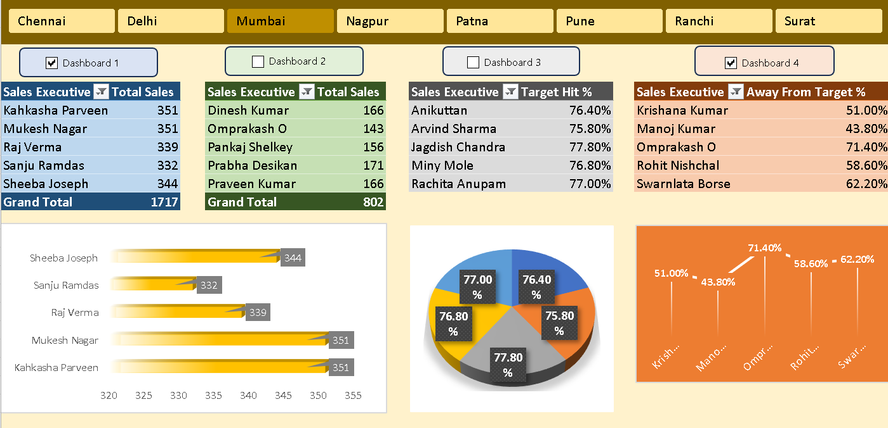

# Sales Performance Dashboard (Excel)

## Project Overview
This project demonstrates the creation of an interactive sales performance dashboard using Microsoft Excel. The dashboard provides insights into sales performance, target achievement, and executive productivity.

## Business Problem
Sales managers often struggle to monitor individual performance and compare sales results against targets. This dashboard helps visualize key performance metrics for better decision-making.

## Dataset
The dataset contains the following fields:

- Sales Executive
- Region
- Daily Sales
- Total Sales
- Sales Target
- Target Achievement %

## Tools Used
- Microsoft Excel
- Pivot Tables
- Pivot Charts
- Data Cleaning
- Dashboard Design

## Key Insights
- Identify top-performing sales executives
- Compare target vs actual sales
- Analyze regional sales performance
- Detect performance gaps

## Dashboard Preview

## Project Outcome
The dashboard provides a clear overview of sales performance and enables managers to quickly identify areas of improvement and high-performing executives.
